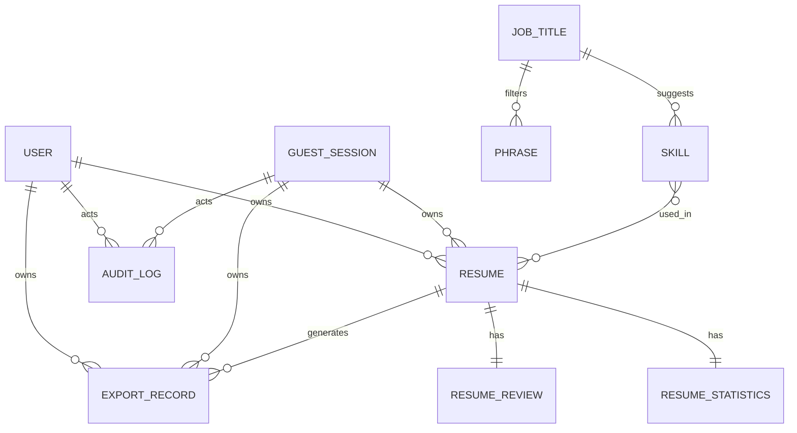

# ERD  MVP

Owner: **data-modeler** (+ **security-engineer** ownership review) · Pack step **6** · Status: `draft`

> Blocked until style freeze (gate G2). Database: **Neon Postgres** (`DATABASE_URL` pooled + `DIRECT_URL` for migrations).
> This ERD is written to match the actual upstream tech: `AHMED9937/headcv` v5.1.6 uses **Drizzle ORM** with **Better Auth**, not Prisma/Clerk. The schema below inherits the upstream tables and extends them only where v1 behaviour requires it (guest sessions, deterministic review, curated content catalogue, export audit).

---

## Better Auth → Neon sync (baseline)

- Auth is handled by **Better Auth** (`packages/auth`) with the **Drizzle adapter** (`@better-auth/drizzle-adapter`).
- Better Auth owns the `user`, `session`, `account`, `verification`, `twoFactor`, `passkey`, `apikey`, `jwks`, `oauthClient`, `oauthRefreshToken`, `oauthAccessToken`, and `oauthConsent` tables.
- Business-data ownership always uses the Neon `User.id` foreign key, never a Better Auth-only check.
- Guest users are represented by a new `GuestSession` table, not a `User` row, until account creation triggers a one-time migration.
- The upstream `resume.userId` column is `NOT NULL`; for v1 we change it to nullable and add `guestSessionId` so the guest-first flow works.

---

## Plain-language summary (for founder review  not the raw schema)

A guest starts a `Resume` tied only to a temporary `GuestSession`. The full CV content, section order, and design settings live inside a single JSONB document (`Resume.data`). The product uses curated `JobTitle`, `Phrase`, and `Skill` catalogues as suggestions, and stores deterministic review findings in `ResumeReview`. When a guest signs up, their `Resume` rows migrate to a `User`. Every sensitive action is recorded in `AuditLog` without storing CV text. Better Auth handles sign-in sessions and account credentials.

---

## Entities / relations



> Note: section content, ordering, hiding, and design are stored inside the `Resume.data` JSONB document, not in separate tables. This matches the upstream `ResumeData` schema.
>
> Note: the ERD diagram uses uppercase table names for visual clarity; the actual database tables follow the snake_case Drizzle schema definitions shown below (e.g., `ResumeReview` in the diagram is `resume_review` in the schema).

### Entity definitions

**User (Better Auth)**
Authenticated user, created and updated by Better Auth. The upstream columns are `id`, `name`, `email`, `emailVerified`, `username`, `displayUsername`, `role`, `banned`, etc. Business data references `User.id`.

**Session / Account / Verification (Better Auth)**
Standard Better Auth tables. `session` tracks active tokens; `account` links social/credential providers; `verification` handles email confirmation and password reset. Inherited from upstream without change.

**GuestSession**
New table for the guest-first MVP. `id`, `fingerprint` (non-PII hash), `expiresAt`, `locale`, `createdAt`. Linked to `Resume` via `guestSessionId`. Deleted after successful migration or TTL expiry.

**Resume**
Upstream table with two v1 changes: `userId` becomes nullable and a nullable `guestSessionId` is added. Stores `name` (title), `slug`, `tags`, `isPublic`, `isLocked`, `password`, and `data` (JSONB). The JSONB document contains all CV content and design metadata.

**ResumeStatistics**
Inherited upstream table (one-to-one with `Resume`). Tracks `views`, `downloads`, `lastViewedAt`, `lastDownloadedAt`. Disabled for public sharing in v1 but kept for future use.

**ResumeReview**
New table. Replaces the upstream AI-driven `resumeAnalysis`. Stores deterministic review findings as JSONB, one row per review run. `status` is `pass`, `improve`, or `review`.

**ExportRecord**
New table. Tracks each export attempt (`pdf` or `docx`), filename, storage path, page count, and status. Links to `Resume` and to `User` or `GuestSession`.

**JobTitle**
New curated catalogue. Used for quick setup suggestions and to filter phrases/skills. Localized (`titleEn`, `titleAr`).

**Phrase**
New curated catalogue. Pattern text in English and Arabic with placeholder markers. Filtered by `jobTitleId` and `sectionType`.

**Skill**
New curated catalogue. Skill name, optional Arabic name, category, associated job titles, and experience levels.

**AuditLog**
New append-only table. `action`, `entityType`, `entityId`, hashed actor identifiers, `createdAt`. Never stores CV text or PII.

### ResumeData (the JSONB document inside `Resume.data`)

`ResumeData` is the upstream Zod schema from `packages/schema/src/resume/data.ts`. It contains:

- `picture`: profile photo settings (URL, size, border, shadow).
- `basics`: name, headline, email, phone, location, website, custom fields.
- `summary`: title, columns, hidden flag, content HTML.
- `sections`: profiles, experience, education, projects, skills, languages, interests, awards, certifications, publications, volunteer, references. Each section has `title`, `columns`, `hidden`, and `items[]`.
- `customSections`: user-created sections with a type and items.
- `metadata`:
  - `template`: string ID referencing a code-level template (e.g., `onyx`).
  - `layout`: sidebar width and page column ordering.
  - `page`: margins, gaps, format (`a4`/`letter`/`free-form`), locale, `hideIcons`.
  - `design`: primary/text/background colors and level icon style.
  - `typography`: body and heading font family, weights, size, line height.
  - `notes`: private author notes.

This means there is **no `ResumeDesign`, `ResumeSection`, or `Template` database table** in v1. Sections, layout, typography, and template choice are all expressed inside the JSONB document.

---

## Draft Drizzle notes

These are model names, key fields, uniques, and indexes written in Drizzle ORM syntax, matching the upstream `packages/db/src/schema/*` files. The full schema will be reconciled with the forked `packages/db/src/schema/`.

### User (Better Auth)

```ts
export const user = pgTable("user", {
  id: text("id").primaryKey().$defaultFn(() => generateId()),
  name: text("name").notNull(),
  email: text("email").notNull().unique(),
  emailVerified: boolean("email_verified").notNull().default(false),
  username: text("username").notNull().unique(),
  displayUsername: text("display_username").notNull().unique(),
  image: text("image"),
  role: text("role").default("user"),
  banned: boolean("banned").default(false),
  banReason: text("ban_reason"),
  banExpires: timestamp("ban_expires", { withTimezone: true }),
  lastActiveAt: timestamp("last_active_at", { withTimezone: true }),
  createdAt: timestamp("created_at", { withTimezone: true }).notNull().defaultNow(),
  updatedAt: timestamp("updated_at", { withTimezone: true }).notNull().defaultNow().$onUpdate(() => new Date()),
}, (t) => [
  uniqueIndex("user_email_lower_unique_idx").on(lower(t.email)),
  index().on(t.createdAt.asc()),
]);
```

Upstream table. `role` is used for admin checks. Email is normalized to lowercase via a unique index.

### Session / Account / Verification (Better Auth)

Inherited from upstream `auth.ts`:

- `session`: token, ipAddress, userAgent, userId, expiresAt.
- `account`: social/credential provider linkage (providerId, accountId, userId, password hash, tokens).
- `verification`: email verification and password-reset codes (identifier, value, expiresAt).

For the MVP we rely on the standard email/password flow, so `session`, `account`, and `verification` are the most relevant tables. OAuth/passkey/2FA tables stay for upstream compatibility but are not v1 features.

### GuestSession

```ts
export const guestSession = pgTable("guest_session", {
  id: text("id").primaryKey().$defaultFn(() => generateId()),
  fingerprint: text("fingerprint"), // non-PII hash
  locale: text("locale"),
  expiresAt: timestamp("expires_at", { withTimezone: true }).notNull(),
  createdAt: timestamp("created_at", { withTimezone: true }).notNull().defaultNow(),
}, (t) => [
  index().on(t.expiresAt),
]);
```

New table. TTL is short (for example 30 days). Cleanup job deletes expired rows.

### Resume

```ts
export const resume = pgTable("resume", {
  id: text("id").primaryKey().$defaultFn(() => generateId()),
  name: text("name").notNull(), // CV title shown in dashboard
  slug: text("slug").notNull(),
  tags: text("tags").array().notNull().default([]),
  isPublic: boolean("is_public").notNull().default(false),
  isLocked: boolean("is_locked").notNull().default(false),
  password: text("password"),
  // v1 change from upstream: nullable userId + new guestSessionId
  userId: text("user_id").references(() => user.id, { onDelete: "cascade" }),
  guestSessionId: text("guest_session_id").references(() => guestSession.id, { onDelete: "cascade" }),
  originalGuestSessionId: text("original_guest_session_id"), // audit only
  data: jsonb("data").notNull().$type<ResumeData>().$defaultFn(() => defaultResumeData),
  createdAt: timestamp("created_at", { withTimezone: true }).notNull().defaultNow(),
  updatedAt: timestamp("updated_at", { withTimezone: true }).notNull().defaultNow().$onUpdate(() => new Date()),
}, (t) => [
  unique().on(t.slug, t.userId),
  index().on(t.userId),
  index().on(t.guestSessionId),
  index().on(t.createdAt.asc()),
  index().on(t.userId, t.updatedAt.desc()),
  index().on(t.isPublic, t.slug, t.userId),
]);
```

**Important changes from upstream:**
- `userId` is now nullable.
- `guestSessionId` is added and also nullable.
- Exactly one of `userId` or `guestSessionId` must be non-null at any time.
- `slug` uniqueness is scoped to `userId`; guest resumes use a generated slug until migration.
- `data` is the full `ResumeData` JSONB document.

### ResumeStatistics

```ts
export const resumeStatistics = pgTable("resume_statistics", {
  id: text("id").primaryKey().$defaultFn(() => generateId()),
  views: integer("views").notNull().default(0),
  downloads: integer("downloads").notNull().default(0),
  lastViewedAt: timestamp("last_viewed_at", { withTimezone: true }),
  lastDownloadedAt: timestamp("last_downloaded_at", { withTimezone: true }),
  resumeId: text("resume_id").unique().notNull().references(() => resume.id, { onDelete: "cascade" }),
  createdAt: timestamp("created_at", { withTimezone: true }).notNull().defaultNow(),
  updatedAt: timestamp("updated_at", { withTimezone: true }).notNull().defaultNow().$onUpdate(() => new Date()),
});
```

Inherited upstream table. Kept for compatibility; public view/download counters are not exposed in v1 because public sharing is a Should feature.

### ResumeReview

```ts
export const resumeReview = pgTable("resume_review", {
  id: text("id").primaryKey().$defaultFn(() => generateId()),
  resumeId: text("resume_id").unique().notNull().references(() => resume.id, { onDelete: "cascade" }),
  findings: jsonb("findings").notNull().$type<ReviewFinding[]>(),
  status: text("status").notNull(), // pass, improve, review
  createdAt: timestamp("created_at", { withTimezone: true }).notNull().defaultNow(),
  updatedAt: timestamp("updated_at", { withTimezone: true }).notNull().defaultNow().$onUpdate(() => new Date()),
}, (t) => [
  index().on(t.resumeId),
]);
```

New table. Replaces the upstream AI `resumeAnalysis` table. Findings are deterministic: empty required data, impossible dates, unresolved placeholders, duplicates, long bullets, spelling, missing contact, page overflow, privacy warnings. No score, no LLM metadata.

### ExportRecord

```ts
export const exportRecord = pgTable("export_record", {
  id: text("id").primaryKey().$defaultFn(() => generateId()),
  resumeId: text("resume_id").notNull().references(() => resume.id, { onDelete: "cascade" }),
  userId: text("user_id").references(() => user.id, { onDelete: "cascade" }),
  guestSessionId: text("guest_session_id").references(() => guestSession.id, { onDelete: "cascade" }),
  format: text("format").notNull(), // pdf, docx
  filename: text("filename").notNull(),
  storageKey: text("storage_key"), // S3/local path
  pageCount: integer("page_count"),
  status: text("status").notNull(), // started, complete, failed
  errorMessage: text("error_message"),
  createdAt: timestamp("created_at", { withTimezone: true }).notNull().defaultNow(),
  completedAt: timestamp("completed_at", { withTimezone: true }),
}, (t) => [
  index().on(t.resumeId, t.createdAt.desc()),
]);
```

New table. Storage uses S3-compatible or local filesystem depending on env; the DB only stores the key/path. File URLs are signed and short-lived.

### JobTitle

```ts
export const jobTitle = pgTable("job_title", {
  id: text("id").primaryKey().$defaultFn(() => generateId()),
  titleEn: text("title_en").notNull(),
  titleAr: text("title_ar"),
  category: text("category"),
  experienceLevels: text("experience_levels").array().notNull().default([]),
  isActive: boolean("is_active").notNull().default(true),
}, (t) => [
  index().on(t.titleEn),
  index().on(t.titleAr),
]);
```

New curated catalogue. `experienceLevels` can be `entry`, `mid`, `senior`, `executive`.

### Phrase

```ts
export const phrase = pgTable("phrase", {
  id: text("id").primaryKey().$defaultFn(() => generateId()),
  jobTitleId: text("job_title_id").references(() => jobTitle.id, { onDelete: "set null" }),
  sectionType: text("section_type").notNull(), // experience, summary, etc.
  patternEn: text("pattern_en").notNull(),
  patternAr: text("pattern_ar"),
  placeholders: jsonb("placeholders").notNull().$type<string[]>(), // marker names to resolve
  experienceLevels: text("experience_levels").array().notNull().default([]),
  isActive: boolean("is_active").notNull().default(true),
}, (t) => [
  index().on(t.jobTitleId, t.sectionType, t.experienceLevels),
]);
```

New curated catalogue. Phrases are selectable in the builder; unresolved placeholders block acceptance.

### Skill

```ts
export const skill = pgTable("skill", {
  id: text("id").primaryKey().$defaultFn(() => generateId()),
  nameEn: text("name_en").notNull(),
  nameAr: text("name_ar"),
  category: text("category"),
  jobTitleIds: jsonb("job_title_ids").notNull().$type<string[]>().default([]),
  experienceLevels: text("experience_levels").array().notNull().default([]),
  isActive: boolean("is_active").notNull().default(true),
}, (t) => [
  index().on(t.nameEn),
  index().on(t.nameAr),
]);
```

New curated catalogue. `jobTitleIds` is a JSONB array of IDs for simple filtering in v1; a join table can be introduced later.

### AuditLog

```ts
export const auditLog = pgTable("audit_log", {
  id: text("id").primaryKey().$defaultFn(() => generateId()),
  actorUserId: text("actor_user_id").references(() => user.id, { onDelete: "set null" }),
  actorGuestSessionId: text("actor_guest_session_id").references(() => guestSession.id, { onDelete: "set null" }),
  action: text("action").notNull(), // create, update, delete, export, migrate, login, logout
  entityType: text("entity_type").notNull(),
  entityId: text("entity_id").notNull(),
  ipHash: text("ip_hash"),
  userAgentHash: text("user_agent_hash"),
  createdAt: timestamp("created_at", { withTimezone: true }).notNull().defaultNow(),
}, (t) => [
  index().on(t.actorUserId, t.createdAt.desc()),
  index().on(t.entityType, t.entityId),
]);
```

New table. Append-only. Never stores CV text or raw PII.

---

## Ownership fields

| Entity | Owner field | Cascade rule | Notes |
|---|---|---|---|
| `User` | `id` (self) | Soft delete via `deletedAt` or app-level | Better Auth controls writes; app controls business data |
| `Session` / `Account` / `Verification` | `userId` | `cascade` | Better Auth tables |
| `GuestSession` | `id` (self) | Expire after TTL | Anonymous; resumes linked by FK |
| `Resume` | `userId` or `guestSessionId` | Cascade to `ResumeStatistics`, `ResumeReview`, `ExportRecord` | Exactly one owner at a time; migration moves from guest to user |
| `ResumeStatistics` | `resumeId` | Cascade with `Resume` | Internal counters |
| `ResumeReview` | `resumeId` | Cascade with `Resume` | Computed findings; one row per resume in v1 |
| `ExportRecord` | `resumeId` → `Resume` owner | Cascade with `Resume` | File URL must be signed and time-limited |
| `AuditLog` | `actorUserId` or `actorGuestSessionId` | Append-only, never user-deleted | No CV text or PII in message |
| `JobTitle` / `Phrase` / `Skill` | content admin (no per-user owner) | Soft delete by admin | Read-only catalogue tables |

---

## Security review notes (security-engineer)

- **No AI data flows**: `ResumeReview.findings` and the `Phrase`/`Skill` catalogues are deterministic. The upstream `aiProvider`, `agentThread`, `agentMessage`, `agentAction`, and `agentAttachment` tables are **removed** in the v1 fork.
- **Guest isolation**: `Resume` must enforce that `userId` and `guestSessionId` are mutually exclusive and that the caller owns the active owner ID. A guest cannot read another guest's resume.
- **Migration integrity**: `Resume.userId` and `Resume.guestSessionId` must be updated in one transaction. `originalGuestSessionId` preserves the audit trail.
- **Resume data privacy**: `AuditLog` never stores `Resume.data`, export file content, or contact details. `ExportRecord.storageKey` points to storage; the generated URL must be signed and short-lived.
- **Rate limiting**: auth and export endpoints must be rate-limited. Use the existing `packages/api` rate-limit helpers.
- **Soft delete**: `Resume` uses no `deletedAt` column in upstream; v1 keeps upstream behavior (archive/delete handled by app logic or `status` enum). If a soft-delete requirement appears later, add `deletedAt`.
- **Better Auth trust**: `User` rows are only written by Better Auth adapters/webhooks, never directly by client API calls.
- **Storage**: uploaded photos are stored under paths keyed by `resumeId` or `guestSessionId`; access control is enforced by signed URLs or by serving through an authenticated proxy.

- [ ] security-engineer reviewed ownership + roles on: `YYYY-MM-DD`

---

## Feedback log (evaluator-optimizer loop  light, one round expected)

| Date | Round | Founder feedback | Change made |
|------|-------|-------------------|-------------|
| | 1 | | |

---

## Founder approval

- [ ] Founder confirmed the plain-language summary matches their product on: `YYYY-MM-DD` (does not require reading the schema itself)