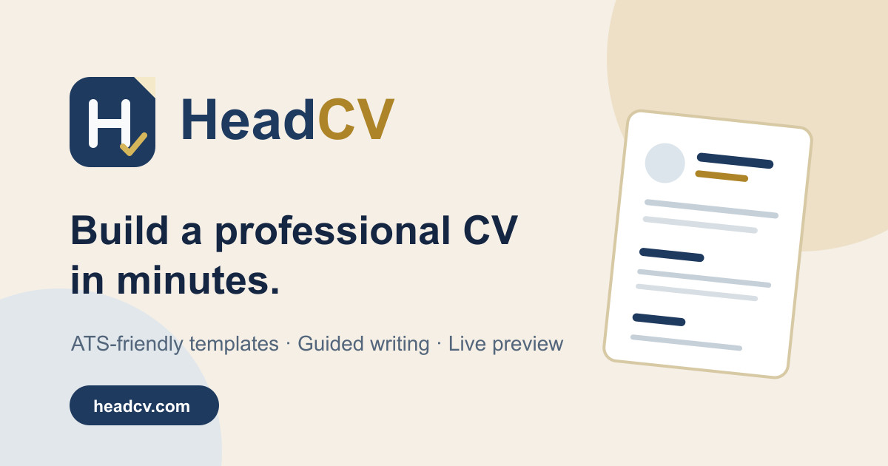
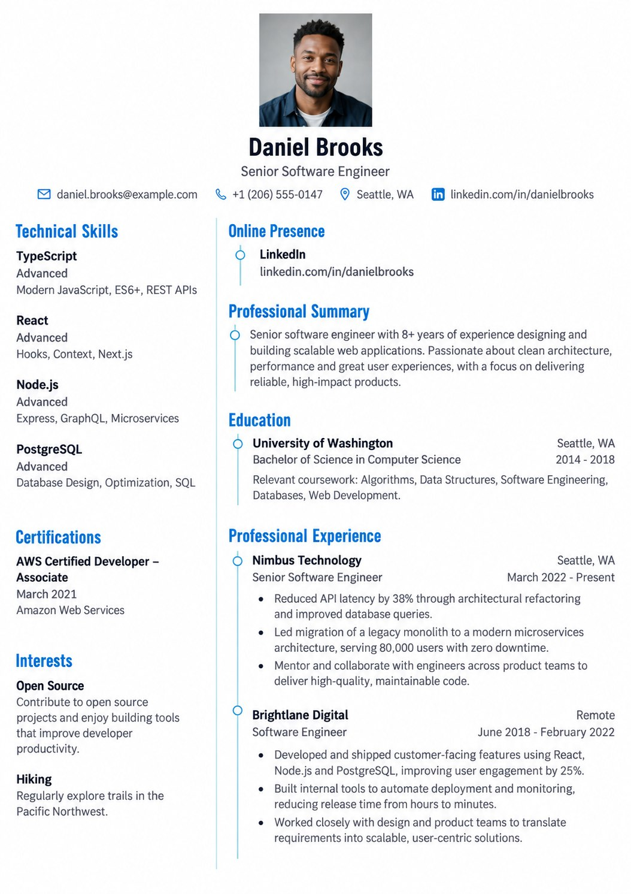
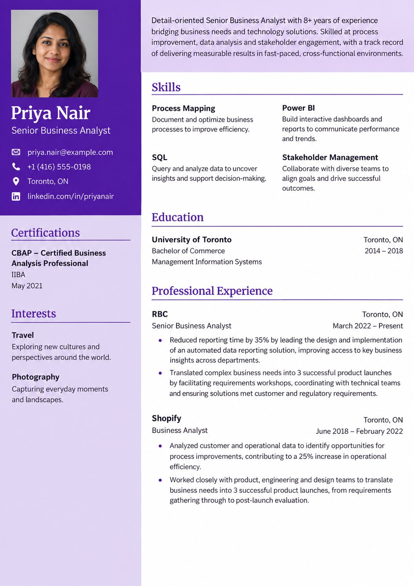
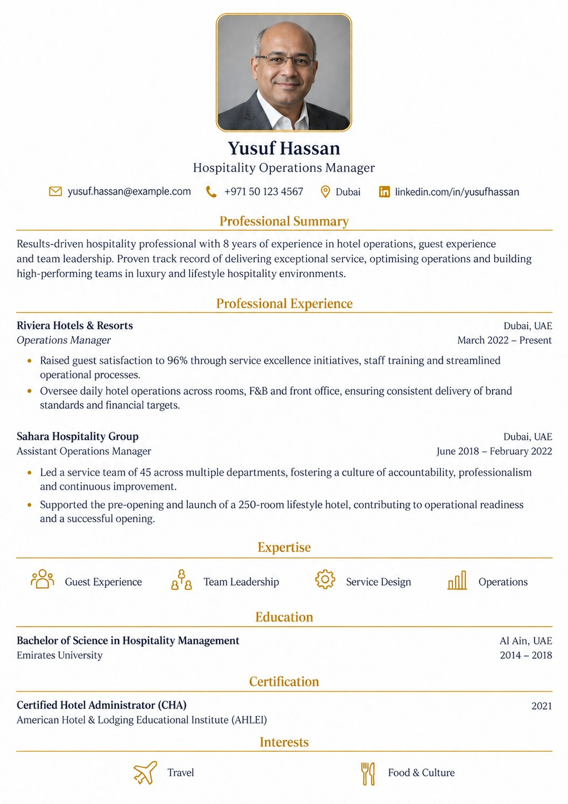
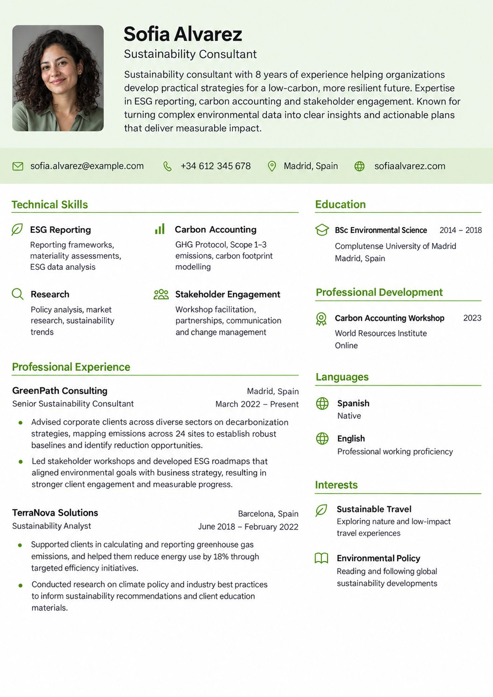
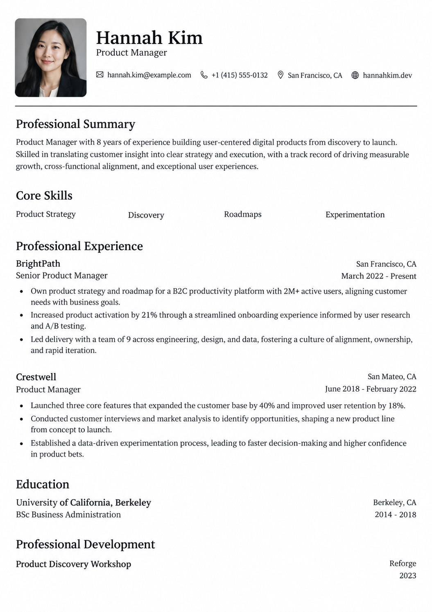
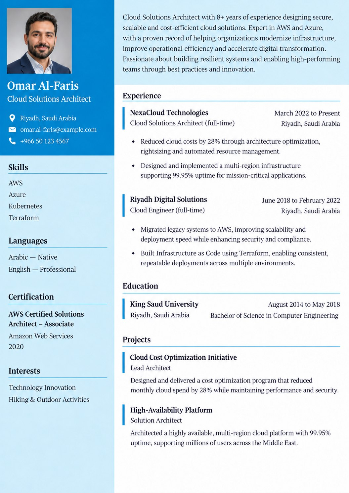
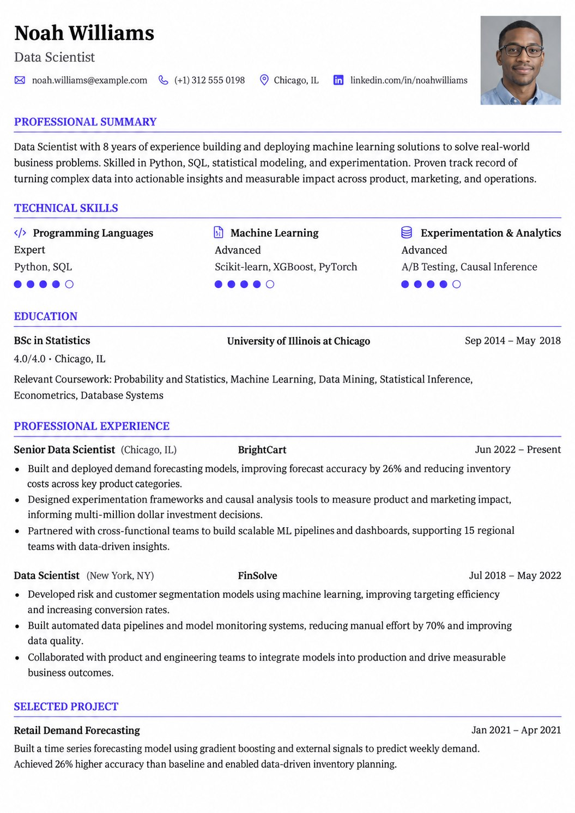
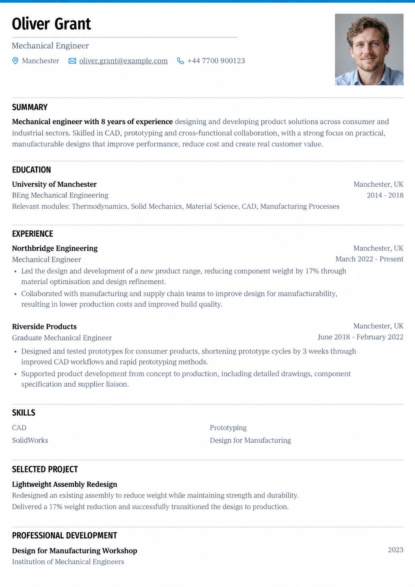

<div align="center">
  <a href="https://headcv.com">
    
  </a>

  <h1>HeadCV</h1>

  <p>HeadCV is a free, open-source, ATS-friendly resume and CV builder. Start with a template, fill in your details, and export a professional PDF in minutes. No account required to try it.</p>

  <p>
    <a href="https://headcv.com"><strong>Get Started</strong></a>
    ·
    <a href="./docs/getting-started/quickstart.mdx"><strong>Quick Start</strong></a>
  </p>

  <p>
    
    
    
  </p>
</div>

---

HeadCV makes resume and CV creation fast, private, and predictable. The app gives users a live preview, drag-and-drop section control, and multiple export formats while keeping data ownership first. The entire stack is open-source under the MIT license with no tracking or ads by default.

## Features

**Resume Building**

- Live PDF preview as you type
- Multiple export formats (PDF, JSON, DOCX)
- Drag-and-drop section ordering
- Custom sections for any content type
- Rich text editor with formatting support

**Templates**

- Professionally designed, ATS-friendly templates
- A4 and Letter size support
- Customizable colors, fonts, and spacing
- Custom CSS for advanced styling

**Privacy & Control**

- Self-host on your own infrastructure
- No tracking or analytics by default
- Full data export at any time
- Delete your data permanently with one click

**Extras**

- AI-assisted writing and resume analysis (optional, user-controlled)
- Multi-language support including Arabic and other RTL languages
- Share resumes via unique public links
- Import from JSON Resume and HeadCV JSON formats
- Dark and light mode
- Passkey and two-factor authentication

## Templates

<table>
  <tr>
    <td align="center">
      
      <br /><sub><b>Azurill</b></sub>
    </td>
    <td align="center">
      
      <br /><sub><b>Bronzor</b></sub>
    </td>
    <td align="center">
      
      <br /><sub><b>Chikorita</b></sub>
    </td>
    <td align="center">
      
      <br /><sub><b>Ditto</b></sub>
    </td>
  </tr>
  <tr>
    <td align="center">
      
      <br /><sub><b>Gengar</b></sub>
    </td>
    <td align="center">
      
      <br /><sub><b>Glalie</b></sub>
    </td>
    <td align="center">
      
      <br /><sub><b>Kakuna</b></sub>
    </td>
    <td align="center">
      
      <br /><sub><b>Lapras</b></sub>
    </td>
  </tr>
  <tr>
    <td align="center">
      
      <br /><sub><b>Leafish</b></sub>
    </td>
    <td align="center">
      
      <br /><sub><b>Onyx</b></sub>
    </td>
    <td align="center">
      
      <br /><sub><b>Pikachu</b></sub>
    </td>
    <td align="center">
      
      <br /><sub><b>Rhyhorn</b></sub>
    </td>
  </tr>
  <tr>
    <td align="center">
      
      <br /><sub><b>Ditgar</b></sub>
    </td>
    <td align="center">
      
      <br /><sub><b>Meowth</b></sub>
    </td>
    <td align="center">
      
      <br /><sub><b>Scizor</b></sub>
    </td>
  </tr>
</table>

## Quick Start

The fastest way to run HeadCV locally is with Docker:

```bash
# Clone the repository
git clone --depth=1 https://github.com/AHMED9937/headcv.git
cd headcv

# Copy the example environment and start the stack
cp .env.example .env
docker compose up -d

# Access the app
open http://localhost:3000
```

For local development with Node.js 24, pnpm, and PostgreSQL, see the [setup guide](./docs/getting-started/quickstart.mdx) and [AGENTS.md](./AGENTS.md).

## UI/UX Best Practices

HeadCV is built around a content-first, tool-like workspace. The UI should feel like a focused productivity app, never a marketing page. These are the principles that shape every screen:

- **Content is the hero.** The chrome is deliberately grayscale. Color comes from the user's resume content, not the app shell.
- **Dark by default.** The dark workspace makes resume previews pop and reduces eye strain. Light mode is a full alternative, not an afterthought.
- **Grayscale palette for app chrome.** Use the defined `--primary`, `--secondary`, `--muted`, and `--background` tokens. The only chromatic exception is destructive red for errors and delete actions.
- **Tight radius, precise shapes.** Default to `rounded-lg` (0.3rem). The tool should feel precise, not playful.
- **IBM Plex Sans Variable everywhere.** One typeface for the entire UI. Resume content uses a separate user-selected font system.
- **Motion with purpose.** Use 0.35s–0.6s fade-up reveals, quick 0.2s hover transitions, and staggered entrances. Always respect `prefers-reduced-motion`.
- **Three-panel builder.** Left sidebar for forms, center for the live PDF preview, right sidebar for design controls. Panels persist in cookies and collapse on mobile.
- **RTL-first layout.** Use logical CSS properties (`ps-`, `pe-`, `ms-`, `me-`) so the UI mirrors correctly for Arabic, Hebrew, and other RTL locales.
- **Never hardcode text.** All user-facing strings use Lingui macros (`t`, `msg`, `<Trans>`) with `.po` files under `apps/web/locales/`.
- **Resume is separate from the app shell.** Template colors, fonts, and page layout are user-controlled and completely independent of the HeadCV UI palette.

For the full design system, see [DESIGN.md](./DESIGN.md).

## Tech Stack

| Category         | Technology                               |
| ---------------- | ---------------------------------------- |
| Web app          | TanStack Start, React 19, Vite           |
| Server           | Hono, Node.js 24                         |
| API              | oRPC (type-safe RPC)                     |
| Auth             | Better Auth                              |
| Database         | PostgreSQL with Drizzle ORM              |
| Storage          | Local filesystem or S3-compatible        |
| Styling          | Tailwind CSS 4                           |
| UI Components    | Base UI + shadcn-style shared package    |
| i18n             | Lingui                                   |
| State management | Zustand, TanStack Query                  |
| PDF rendering    | `@react-pdf/renderer` (client-side)      |

## Deploying

**Vercel**

`vercel.json` and `tooling/vercel-build.mjs` are configured for Vercel's Node 24 functions. Set the required environment variables (`APP_URL`, `DATABASE_URL`, `AUTH_SECRET`) and any optional storage, SMTP, or OAuth credentials. See `.env.example` for the complete list.

**Docker / Self-hosting**

Build and run the stack with Docker Compose:

```bash
docker compose up -d
```

This starts PostgreSQL, optional S3-compatible SeaweedFS, and the HeadCV app. Tweak `.env` to match your environment.

## Project Structure

- `apps/web` — TanStack Start web app, landing page, builder, dashboard, and public resume views
- `apps/server` — Hono server, API, auth, static uploads, and production build entry
- `packages/*` — Shared packages under the `@headcv/*` workspace scope (`api`, `auth`, `db`, `email`, `env`, `pdf`, `schema`, `ui`, etc.)
- `migrations/` — Drizzle database migrations
- `docs/` — Product and development documentation

## Contributing

Contributions are welcome. Open an issue or pull request on the [main repository](https://github.com/AHMED9937/headcv).

1. Fork the repository
2. Create a feature branch (`git checkout -b feature/your-feature`)
3. Commit your changes
4. Push and open a pull request

See [AGENTS.md](./AGENTS.md) for the codebase conventions and architecture map.

## License

[MIT](./LICENSE) — do whatever you want with it.
